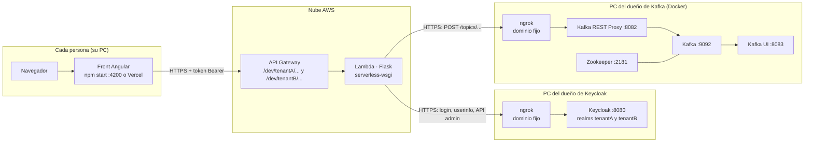
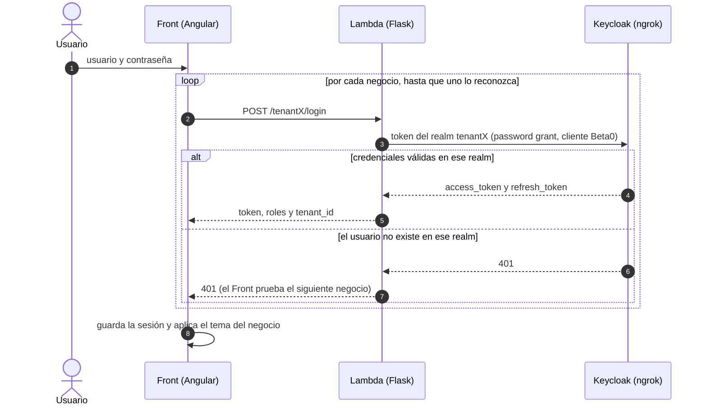
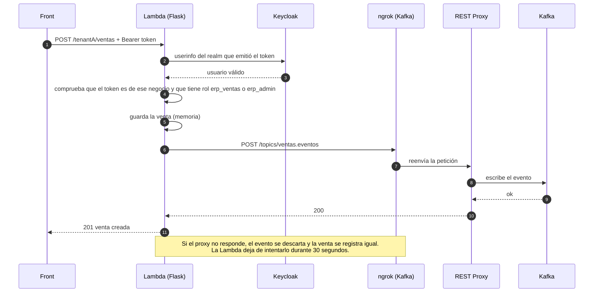
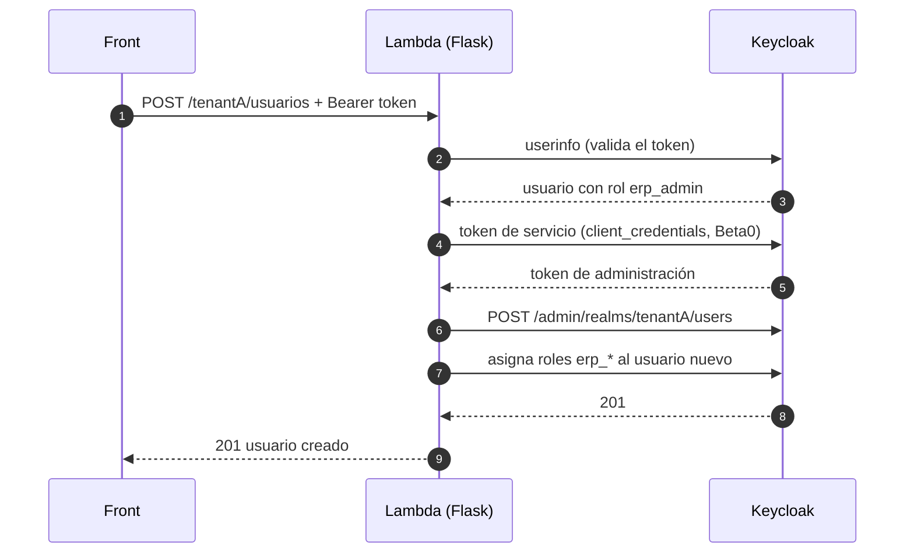
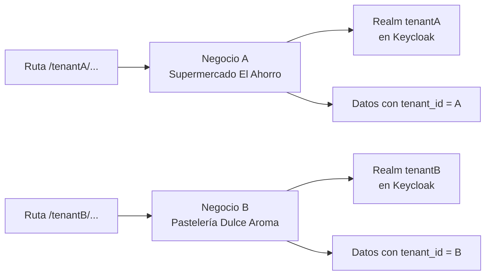
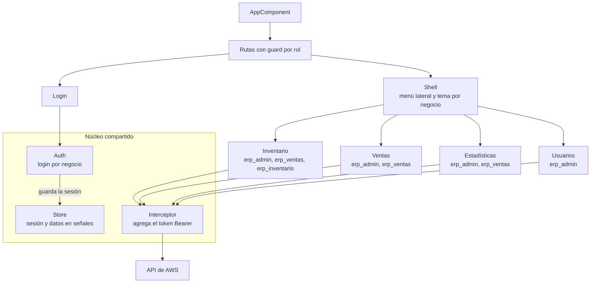
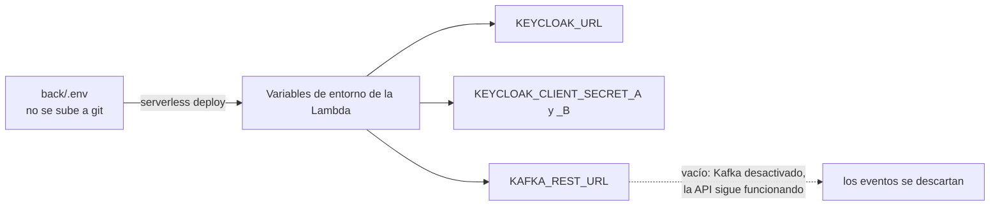

# Arquitectura de InSync

InSync es un ERP multi-tenant pequeño (inventario, ventas, usuarios y estadísticas) para dos negocios de ejemplo: **tenant A** (Supermercado El Ahorro) y **tenant B** (Pastelería Dulce Aroma). Está repartido en piezas independientes que corren en máquinas distintas y se comunican solo por red.

> Los diagramas usan [Mermaid](https://mermaid.js.org/). GitHub los dibuja directamente. En VS Code hace falta la extensión *Markdown Preview Mermaid Support*.

## 1. Vista general

**Por qué ngrok:** la Lambda vive en AWS y no puede abrir conexiones hacia `localhost` de una PC. ngrok publica Keycloak y el proxy HTTP de Kafka con un dominio fijo por servicio (cada cuenta gratuita incluye uno, por eso cada servicio usa la cuenta de una persona distinta).

## 2. Inicio de sesión

El Front no sabe a qué negocio pertenece el usuario: prueba el login contra la API de cada negocio, en orden, y el primero que lo reconoce define su negocio, su tema y la API que usará después.

## 3. Petición protegida y evento a Kafka

Ejemplo: registrar una venta. El Front agrega el token a cada petición con un interceptor; si la API responde 401, cierra la sesión.

## 4. Gestión de usuarios reales

La pantalla Usuarios lee y escribe los usuarios del realm de cada negocio en Keycloak. Para eso el backend usa la **cuenta de servicio** del cliente `Beta0` (no el usuario `admin` de Keycloak).

Solo `erp_admin` puede usar estas rutas. Un administrador de un negocio nunca ve ni modifica usuarios del otro, porque cada llamada usa el realm del negocio de la ruta.

## 5. Multi-tenant

- Un solo backend atiende ambos negocios; el prefijo de la ruta (`/tenantA` o `/tenantB`) decide cuál.
- Cada negocio tiene su propio realm, con sus usuarios y roles (`erp_admin`, `erp_inventario`, `erp_ventas`).
- Un token emitido por un realm solo sirve para las rutas de su negocio; en otro caso la API responde 403.

## 6. Estructura del Front

Cada sección (inventario, ventas, estadísticas, usuarios) es un módulo que se carga solo cuando se entra a ella. Las estadísticas se calculan **en el navegador** a partir de `GET /ventas`; no leen de Kafka.

## 7. Componentes y puertos

| Componente | Tecnología | Dónde corre | Puerto | Cómo se alcanza |
|---|---|---|---|---|
| Front | Angular | PC de cada persona, o Vercel | 4200 | `http://localhost:4200` |
| Backend (API) | Flask en AWS Lambda con Serverless Framework | AWS (API Gateway + Lambda) | HTTPS | `https://<id>.execute-api.us-east-1.amazonaws.com/dev` |
| Keycloak | Keycloak 26 (ZIP) | PC del dueño de Keycloak | 8080 | dominio fijo de ngrok |
| Kafka REST Proxy | `confluentinc/cp-kafka-rest` | PC del dueño de Kafka (Docker) | 8082 | dominio fijo de ngrok |
| Kafka | `confluentinc/cp-kafka` | PC del dueño de Kafka (Docker) | 9092 | solo local |
| Zookeeper | `confluentinc/cp-zookeeper` | PC del dueño de Kafka (Docker) | 2181 | solo local |
| Kafka UI | `provectuslabs/kafka-ui` | PC del dueño de Kafka (Docker) | 8083 | `http://localhost:8083` |

## 8. Topics de Kafka

| Topic | Eventos (`tipo`) |
|---|---|
| `usuarios.autenticacion` | `login_exitoso`, `login_fallido` |
| `seguridad.accesos` | `acceso_sin_token`, `token_invalido`, `token_de_otro_negocio`, `acceso_denegado` |
| `usuarios.gestion` | `usuario_creado`, `usuario_actualizado`, `usuario_eliminado` |
| `inventario.eventos` | `producto_creado`, `producto_actualizado`, `producto_eliminado`, `stock_bajo` |
| `ventas.eventos` | `venta_registrada`, `venta_anulada` |

Cada evento lleva `tenant_id` y `timestamp`. Nunca se publican contraseñas ni tokens. Los topics se crean solos con el primer evento.

## 9. Configuración por máquina

La URL de Keycloak y los secrets son propios de cada máquina y **no van en el código**. Viven en `back/.env`, que no se sube a git (plantilla: `back/env.ejemplo`).

Cuando se cambia algo del `.env`, hay que volver a ejecutar `npx serverless deploy`: la Lambda guarda los valores del momento del despliegue.

## 10. Notas de diseño

- **Datos en memoria:** productos y ventas viven en la memoria del backend y se regeneran con datos de prueba cuando AWS recicla el contenedor. Los usuarios, en cambio, son reales y viven en Keycloak.
- **Kafka es opcional:** si no hay proxy o no responde, la API funciona igual y los eventos se descartan. Hoy solo se consultan en Kafka UI; ningún servicio los consume.
- **Dependencia de PCs encendidas:** el login funciona solo mientras Keycloak y su túnel estén corriendo en la PC del dueño. Los eventos llegan a Kafka solo mientras el proxy y su túnel estén encendidos.
- **Cómo arrancar todo:** ver [GUIA-OTRA-MAQUINA.md](GUIA-OTRA-MAQUINA.md) (guía técnica) y `GUIA-COMPANEROS-FRONT-Y-KAFKA.pdf` (guía paso a paso para compañeros).
